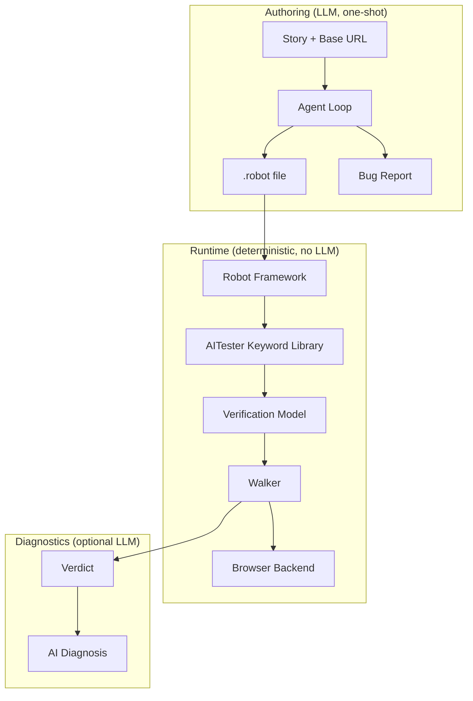

# Architecture Overview

aitester-bdd has three layers that run at different times with different dependencies.



## Layer 1: Authoring

**When:** Once per story, during development.  
**LLM:** Yes — drives exploration and writes the suite.  
**Cost:** ~$0.50-3.00 per suite depending on complexity.

A DeepAgents/LangGraph agent loop reads `SKILL.md` as its system prompt, explores the live target by shelling out to `agent-browser`, and emits a `.robot` file with selectors grounded in real DOM snapshots.

Key files: `authoring/agent_loop.py`, `authoring/tools.py`, `skill/SKILL.md`

## Layer 2: Runtime

**When:** Every test run (CI, local, PR gates).  
**LLM:** No. Zero tokens consumed.  
**Cost:** Free (compute only).

Robot Framework parses the `.robot` file and calls the AITester keyword library. Keywords build an in-memory `Verification` model (plan phase). `Then I finalize verification` triggers the walker, which topo-sorts the rule DAG and executes it against a live browser (execute phase).

Key files: `AITester.py` (keywords), `engine/walk.py` (walker), `engine/browser.py` (adapter)

## Layer 3: Diagnostics

**When:** Only on failure, only if configured.  
**LLM:** Optional — reads the failure trajectory and explains what went wrong.  
**Cost:** ~$0.01-0.05 per failed rule.

The `diagnose` aspect fires on every rule failure. It formats the MDP trajectory (every action, state check, dismiss, timing) and asks the LLM "why did this fail?" The answer lands on `RuleResult.ai_diagnosis` and in `failures.jsonl`.

Key files: `engine/walk_log.py` (aspects), `engine/aspects.py` (registry)

## Data flow

```
.robot file
    → RF parser
    → AITester keywords (build Verification model)
    → walk_verification(verification, ctx)
        → WalkContext.from_env() (resolve runtime config)
        → _build_default_registry(walk_log, ctx) (wire aspects)
        → BrowserAdapter() (pick backend)
        → for each scenario:
            → _topo_sort(rules) (parent-before-child)
            → for each rule in order:
                → _check_guards() (pre-action state checks)
                → _execute_body() (actions + observations)
                → aspects fire at every transition
        → Verdict (aggregate results)
```

## Design principles

1. **LLM is author, not runtime** — authored suites are deterministic RF code
2. **Deferred execution** — keywords build the plan, `finalize` executes it
3. **Position determines semantics** — a StateCheck before actions is a guard; after actions is an assertion
4. **Aspects are cross-cutting** — timing, logging, diagnosis, delay don't touch rule logic
5. **Backend-agnostic** — same `.robot` runs on any of three browsers
6. **Heritage, not reimplementation** — battle-tested WISE gotcha-fixes ported, not re-derived
