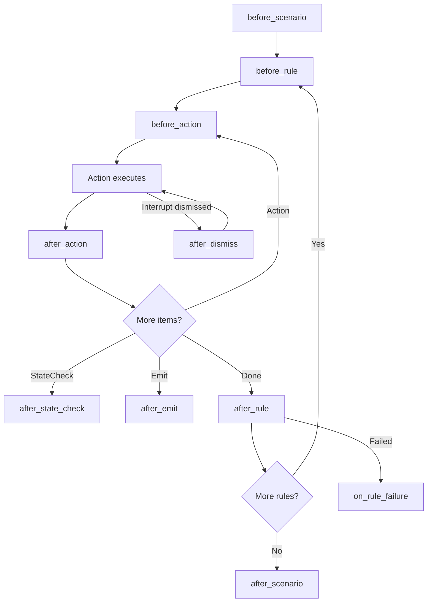

# Aspects (AOP)

The walker fires hooks at every named transition in the rule execution MDP. Aspects are cross-cutting concerns that observe or modify behavior without touching the deterministic walk logic.

## The AspectRegistry

```python
class AspectRegistry:
    def register(self, aspect: Aspect) -> None: ...
    def fire_before_scenario(self, verification, scenario) -> bool: ...
    def fire_after_action(self, rule, action, dt_seconds, raised) -> None: ...
    def fire_on_rule_failure(self, ...) -> str: ...
    # ... more hooks
```

Aspects register with the registry. The walker calls `fire_*` methods at transition points. Each aspect implements only the hooks it cares about.

## Hook lifecycle



## Available hooks

| Hook | Signature | Semantics |
|------|-----------|-----------|
| `before_scenario` | `(verification, scenario) → bool` | Return True to skip scenario |
| `after_scenario` | `(verification, scenario, passed)` | Fires after every scenario |
| `before_rule` | `(verification, scenario, rule, already_passed) → bool` | Return True to skip rule |
| `after_rule` | `(verification, scenario, rule, rule_result)` | Fires after every rule |
| `before_action` | `(rule, action)` | Before each action executes |
| `after_action` | `(rule, action, dt_seconds, raised)` | After each action (with timing) |
| `after_state_check` | `(rule, sc, ok, expected, observed, position)` | After every state check |
| `after_emit` | `(rule, emit_obj, data)` | After explicit emit captures |
| `after_dismiss` | `(rule, selector)` | When an interrupt is dismissed |
| `on_rule_failure` | `(verification, scenario, rule, ...) → str?` | Returns AI diagnosis text |

## Ordering

- `before_*` hooks: fire in registration order; **first to return True wins** (later aspects don't fire)
- `after_*` hooks: fire in registration order; **all run** regardless
- `on_rule_failure`: fire in registration order; **first non-empty return wins** for diagnosis text, but all aspects still fire for side effects

## Built-in aspects

### trajectory

Records every MDP transition into `WalkLog` → `walk_log.jsonl`:

```json
{"kind": "rule_enter", "rule": "login", "parents": [], "ts": "..."}
{"kind": "before_action", "rule": "login", "action": "click", "target": "#submit"}
{"kind": "after_action", "rule": "login", "action": "click", "dt_ms": 87, "raised": false}
{"kind": "state_check", "rule": "login", "check": "url_contains", "ok": true, "position": "observation"}
{"kind": "rule_exit", "rule": "login", "passed": true, "duration_ms": 1230}
```

### instrument

Logs a WARNING when any single action exceeds 0.5 seconds:

```
[instrument] login/click click(#submit) SLOW 1.23s
```

### diagnose

On rule failure, formats the trajectory + context and asks the LLM "why did this fail?" The response becomes `RuleResult.ai_diagnosis` and appends to `failures.jsonl`.

### step_delay

Sleeps N milliseconds after every action (configured via `AITESTER_STEP_DELAY_MS` or `--step-delay`). Registered only when delay > 0. Used for headed visual observation.

## Disabling aspects

```bash
# Disable one
AITESTER_DISABLE_ASPECTS=diagnose aitester run suite.robot

# Disable multiple
AITESTER_DISABLE_ASPECTS=trajectory,diagnose,step_delay aitester run suite.robot
```

## Writing a custom aspect

```python
from aitester_bdd.engine.aspects import Aspect

def make_screenshot_every_action_aspect(output_dir):
    counter = [0]

    def after_action(rule, action, dt_seconds, raised):
        counter[0] += 1
        # browser not available here — aspects observe, not drive
        # use after_state_check for page-state-aware logic

    return Aspect(name="screenshot_every", after_action=after_action)
```

Register it by patching `_build_default_registry` or by extending the walker (the registry is built once per `walk_verification` call).

## WalkContext

The `WalkContext` dataclass centralizes runtime configuration that aspects and the walker need:

```python
@dataclass(frozen=True)
class WalkContext:
    headed: bool = False           # visible browser window
    step_delay_ms: int = 0         # pause after each action
    run_timeout_s: int = 300       # global deadline
    disabled_aspects: frozenset[str] = frozenset()
```

Built once via `WalkContext.from_env()` at the start of `walk_verification`. No env var reads happen after construction — the walker and aspects operate on resolved values.
